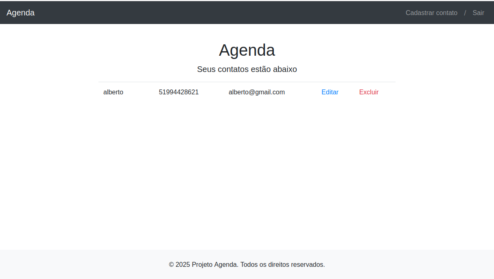

# Contact Book - Agenda de Contatos

Uma aplicação web fullstack para gerenciamento de contatos pessoais com React (frontend) e Node.js (backend).


<br>

## 🚀 Funcionalidades

- ✅ CRUD completo de contatos
- ✅ Autenticação de usuários
- ✅ Criação de Contatos e Exclusão
- ✅ Persistência em banco de dados
<br>

## 🛠 Tecnologias

**Frontend**:
- React.js 
- Styled Components
- React Hook Form
- Context API
- Axios

**Backend**:
- Node.js + Express
- MongoDB 
<br>

## ⚙️ Instalação

1. Clone o repositório:
```bash
git clone https://github.com/luizf-p/contact-book.git
cd contact-book 
```
2. Instale as dependências:
npm install

3. Configure o arquivo .env no diretório server:
CONNECTIONSTRING = sua_string_de_conexao
<br>

## 🚦 Execução

Primeiro terminal (Backend):
```bash
node server.js
```

Segundo terminal (Frontend):
```bash
npm start
```

### Após iniciar ambos, acesse no navegador:
- URL do frontend <br>
http://localhost:3000

- Ou via linha de comando (Linux/Mac)
 ```bash
open http://localhost:3000  # Mac
xdg-open http://localhost:3000  # Linux
```
<br>

### 📝 Licença
- MIT License - Livre para uso
- © 2025 Luiz Fernando


